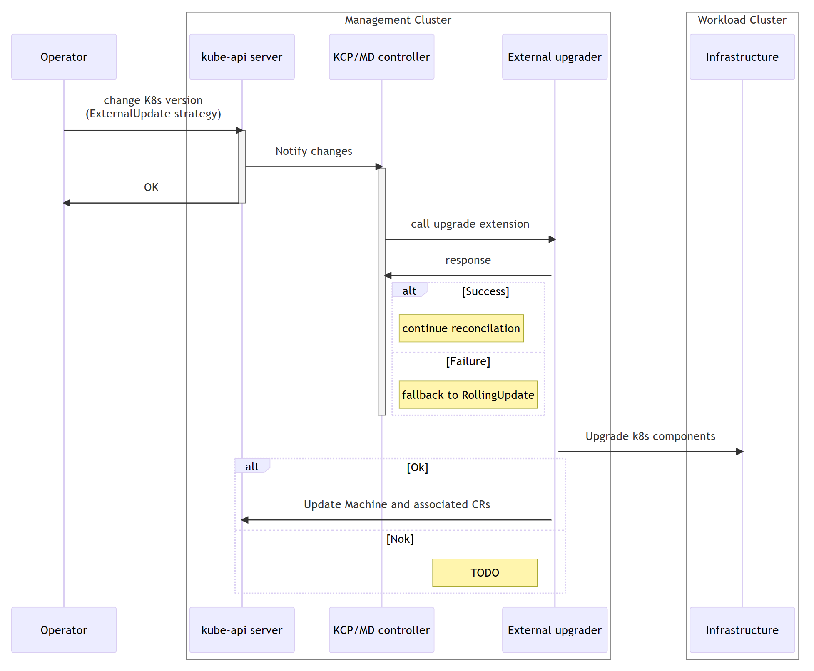

## K3s Support in CAPI
### Goals
- Introduce CAPI boostrap provider and controlplane provider for k3s.
- Allow user to use CAPI to manage k3s target cluster lifecycle.

### Non-Goals
- To support k3s in AKS IOT, changes are needed on each layer, like API and AKS-Operator changes, k3s image preparation and management. It's not part of current scope.

### Proposal
AKS IOT use CAPI as the core component to management target cluster lifecycle. By default, CAPI only support K8s distribution. Well, it provides contract to allow developers to implement their own bootstrap and controlplane logic.

To enable K3s management capability for CAPI, we will need implement bootstrap provider for k3s, let it create node bootstrap script to init/join k3s cluster. And implement controlplane provider for k3s, let it manage k3s controlplane lifecycle (create/upgrade/heal etc.)

There is a community project which works on CAPI k3s providers [cluster-api-k3s](https://github.com/cluster-api-provider-k3s/cluster-api-k3s). Currently, the project is not ready for production. Based on test, it shall be able to create k3s cluster, other management feature like monitor, upgrade, node auto-heal doesn't work well.

We shall leverage this community project, identify the backlogs need to be done and contribute, and push project to be mature.

## In-place Update Support in CAPI
### Goals
- Introduce external upgrade stretegy in CAPI, allowing developers to implement their own upgrade logic.
- Introduce cluster in-place upgrader, implement CAPI external upgrade contract, orchestrate nodes in-place upgrade for target cluster.
- Introduce node in-place upgrader, make A/B partition swap upgrade on cluster node of AKS IOT

### Non-Goals
- Addons like CNI, CSI are not part of cluster infra, shall not be in this scope.
### Proposal
Rollout upgrade in CAPI are not suitable for all scenarios, there are community members raised a feature ask for in-place upgrade, and feature group is created for this topic, we've engaged in since the previous version of AKS-IOT design.

Currently, a proposal is drafted. it suggests a pluggable upgrade strategy architecture that allows external entities (upgrade strategy implementers) to handle the Kubernetes cluster upgrade process. The design aims to decouple core CAPI controllers from the specific mechanisms involved in upgrades, providing users with the flexibility to choose or implement their own strategies. The external upgrade strategy is proposed to be triggered by configuring the Control Plane(KCP)/MachineDeployment with a new field strategy: external. This ensures a consistent user experience by leveraging existing logic in these controllers to determine when changes are required. The detailed design doc is https://hackmd.io/Wv_u2xXJQsaj4wWFQ3PqCQ?view

There was discussion inside group that shall CAPI take more responsibility to do inplace upgrade, or just handover the control to external entity? Conclusion is that we may not have accurate assumption and provide a common enough solution to fit all users' need, so it's better to give user more flexibility to implement their own. Well, by using the external upgrade contract on CAPI, we proposed our general purpose of in-place upgrader, which orchestrate upgrade operations on cluster nodes, and provide contract to delegate infrastructure dependent upgrade operations. This will not be part of CAPI repo, but a separate community project. Well, we are happy if the project are proved to be good and common enough and merge back to CAPI in future. The rough design doc is https://hackmd.io/CM9pJl4bQJOnjFjwudJcbg?view .

Besides, we shall have an operator to do the real in-place upgrade job on AKS IOT node. It needs to do infrastructure dependent job and implement cluster node A/B upgrade. This may has dependency on MOC, a separate section is created for it. 

### Backlogs
- Participate in CAPI in-place upgrade feature design and implementation.
- Create community project to implement general purpose in-place upgrader.
- Implement AKS IOT node in-place upgrader, integrate with MOC.

### A/B Update Capability
Dev Lead: ??

To make in-place upgrade on target cluster, upgrader shall have a channel to interact with Host with abilities below:
- Download image file from cloud to host.
- Write image content to the partition of cluster node.
- Set new boot partition of cluster node.
- Reboot cluster node.

Note that, there is POC project implemented A/B image swap update.
[Pull request 8335438: In-place upgrade intern project - Repos (visualstudio.com)](https://msazure.visualstudio.com/DefaultCollection/msk8s/_git/AksEdge-Operator/pullrequest/8335438?_a=files&path=/docs/InternProject/in-place-upgrade.md). Research is needed to verify:
- If it fits AKS IOT
- If it works for baremetal scenario.
